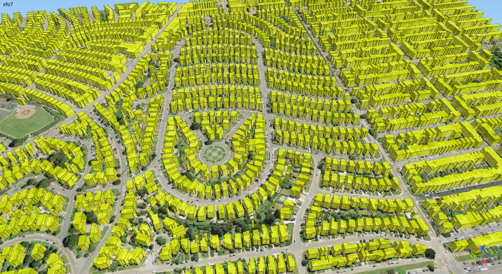

<div align="center">
    <h2 align="center">Pix2Poly: A Sequence Prediction Method for End-to-end Polygonal Building Footprint Extraction</h2>
    <h3 align="center">WACV 2025</h3>
    <a href="https://yeshwanth95.github.io/">Yeshwanth Kumar Adimoolam<sup>1</sup></a>, <a href="https://poullis.org/">Charalambos Poullis<sup>2</sup></a>, <a href="https://melinos.github.io/">Melinos Averkiou<sup>1</sup></a><br>
    <sup>1</sup>CYENS CoE, Cyprus, <sup>2</sup>Concordia University
</div>



[[Project Webpage]()]    [[Paper]()]    [[Video]()]

### Abstract:

Extraction of building footprint polygons from remotely sensed data is essential for several urban understanding tasks such as reconstruction, navigation, and mapping. Despite significant progress in the area, extracting accurate polygonal building footprints remains an open problem. In this paper, we introduce Pix2Poly, an attention-based end-to-end trainable and differentiable deep neural network capable of directly generating explicit high-quality building footprints in a ring graph format. Pix2Poly employs a generative encoder-decoder transformer to produce a sequence of graph vertex tokens whose connectivity information is learned by an optimal matching network. Compared to previous graph learning methods, ours is a truly end-to-end trainable approach that extracts high-quality building footprints and road networks without requiring complicated, computationally intensive raster loss functions and intricate training pipelines. Upon evaluating Pix2Poly on several complex and challenging datasets, we report that Pix2Poly outperforms state-of-the-art methods in several vector shape quality metrics while being an entirely explicit method.

## Installation

## Datasets preparation

## Configurations

## Training

Start training with the following command:

```
torchrun --nproc_per_node=<num GPUs> train_ddp.py 
```

## Evaluation

## Prediction
